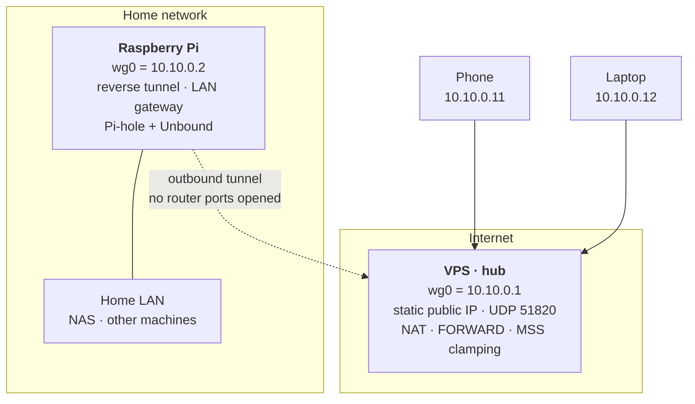

# myVPN — Self-hosted WireGuard VPN with a VPS hub

Reach my home network from anywhere and route traffic through my own server, **without
opening a single port on the home router**. Built from scratch with WireGuard, no
managed VPN service involved.

**Status:** working and in daily use. VPN complete and verified; homelab services in
progress (Pi-hole + Unbound live).

This repository documents the entire build — every command with the reasoning behind it,
and **15 real problems** with their root causes. Configuration templates are sanitized;
no private keys or personal data are included.

## What works today

Every goal is met and verified with evidence, not assumption:

| Goal | How it is verified |
|---|---|
| Reach the whole home LAN from outside | ping to a home device replies with `ttl=63` — one hop less than direct, proving it was routed through the Pi |
| Exit to the internet via the VPS IP | `curl -4 ifconfig.me` returns the VPS public IP when the full tunnel is up |
| No ports opened on the home router | the Pi holds an outbound tunnel open with `PersistentKeepalive`; the router only ever sees outgoing traffic |
| Switchable split / full profiles | two profiles per client, one active at a time |
| DNS filtered and privately resolved | packet capture shows queries going to the DNS root servers, never to a third-party resolver |
| No IPv6 leaks in full tunnel | `curl -6 ifconfig.me` fails while the tunnel is up |
| Survives reboots | tunnels and containers come back automatically on VPS, Pi and laptop |

Side effect worth noting: because DNS is resolved by the Pi through the tunnel, **ad
blocking works on the phone over mobile data, away from home, with no app installed**.

## Architecture

Hub-and-spoke: the VPS is the only peer with a stable public address, so every other
device connects outbound to it. That is what removes the need for port forwarding at
home.

## Documentation

| Document | What it covers |
|---|---|
| [docs/SETUP.md](docs/SETUP.md) | Every command used to build it, and why each one is needed |
| [docs/TROUBLESHOOTING.md](docs/TROUBLESHOOTING.md) | 15 real problems: symptom, root cause, fix, lesson |
| [docs/OPERATIONS.md](docs/OPERATIONS.md) | Day-to-day usage: switching profiles, health checks, adding devices |
| [docs/PLAN.md](docs/PLAN.md) | Design and architecture: the phases and the reasoning behind each decision |
| [docs/HARDENING.md](docs/HARDENING.md) | VPS SSH hardening: key-only auth, custom port, fail2ban |
| [docs/HOMELAB.md](docs/HOMELAB.md) | Self-hosted services on the Pi: storage, Docker, Pi-hole + Unbound |

Configuration templates live in [`vps/`](vps/), [`raspberry/`](raspberry/),
[`clients/`](clients/) and [`pihole/`](pihole/).

## Tech stack

- **WireGuard** — kernel-space, modern crypto, UDP.
- **iptables** — NAT/MASQUERADE, default-DROP firewall (IPv4 and IPv6), MSS clamping.
- **systemd** — `wg-quick@wg0` for auto start, `ssh.socket` for the SSH port,
  `RequiresMountsFor` for storage ordering.
- **fail2ban** + SSH hardening — key-only auth on a non-default port.
- **Docker + Compose** — self-hosted services on the Pi.
- **Pi-hole + Unbound** — DNS filtering with recursive resolution from the root servers.

## What I learned

The interesting part of this project was not following instructions — it was the things
that only show up when something breaks.

- **A passing functional test does not validate a security claim.** Unbound answered
  queries correctly and DNSSEC validated, so every check passed — while it was silently
  forwarding every query to Cloudflare, contradicting the privacy goal the whole design
  was built around. Proving *where data goes* needed a packet capture, not a `dig`.
  ([issue 14](docs/TROUBLESHOOTING.md#14-unbound-was-forwarding-to-cloudflare-not-resolving-recursively))
- **Correlation is not causation.** Sites started hanging right after a DNS change, so it
  looked like a regression from it. It was a latent MTU problem that had been there all
  along. "A few sites broken, most fine" is always MTU, never DNS.
  ([issue 15](docs/TROUBLESHOOTING.md#15-some-sites-hang-while-most-work-fine))
- **Hooks that change global state should run as late as possible.** Disabling IPv6 from
  `PreUp` left the whole system without IPv6 whenever `wg-quick` failed later, because
  `PostDown` never ran. Moving it to `PostUp` means a partial failure changes nothing.
  ([issue 10](docs/TROUBLESHOOTING.md#10-ipv6-left-disabled-after-a-failed-tunnel-start))
- **Verify the actual state, not the configuration file.** `data-root` pointed at the
  external disk and `docker info` confirmed it, yet every image was still on the microSD:
  Docker 29 delegates image storage to containerd, outside that setting. `du` found in
  seconds what reading configs would never have shown.
  ([issue 12](docs/TROUBLESHOOTING.md#12-docker-images-still-on-the-microsd-despite-data-root))
- **Error messages are more specific than they look.** `Connection refused` means
  something answered "nobody is listening" — a bind problem. A firewall drop gives a
  timeout instead. That distinction turned a vague "SSH broke" into a five-minute fix.
  ([issue 5](docs/TROUBLESHOOTING.md#5-ssh-on-the-new-port-refuses-connections))
- **Boot order is a dependency you have to declare.** Docker started before the external
  USB disk was mounted, initialized an empty store, and every container vanished.
  `RequiresMountsFor` fixed it — but only a real reboot could prove it.
  ([issue 13](docs/TROUBLESHOOTING.md#13-containers-vanish-after-a-reboot))
- **Convenience and security are a deliberate trade-off, not a default.** Choosing the
  manual key flow over QR import so the phone's private key never leaves the device, or
  keeping `NOPASSWD` sudo because the real barrier is a passphrase-protected key — both
  are decisions worth writing down with their reasoning, not habits to copy.

## Security notes

- **Private keys never leave the device that generated them.** Only public keys are
  shared. The `.gitignore` blocks `*.key`, real `*.conf` files and `.env`; only
  `*.example` templates are tracked.
- All configuration here uses **placeholders** (`<VPS_PUBLIC_IP>`, `<HOME_LAN_SUBNET>`,
  `<...KEY>`), never real values.
- The VPS firewall uses a **default-DROP policy on both IPv4 and IPv6**, allowing only
  SSH, WireGuard, loopback, established connections and ICMP. ICMPv6 is allowed in full,
  since Neighbor Discovery and PMTUD depend on it.
- Home services are reachable **only through the tunnel** — nothing is exposed to the
  internet.

## License

[MIT](LICENSE). Documentation and templates provided as-is; adapt the security decisions
to your own threat model rather than copying them blindly.
