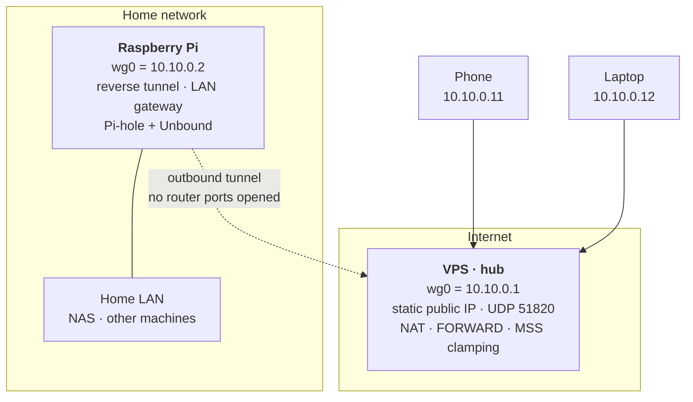

# myVPN — Self-hosted WireGuard VPN with a VPS hub

Reach my home network from anywhere and route traffic through my own server, **without
opening a single port on the home router**. Built from scratch with WireGuard, no
managed VPN service involved.

Working and in daily use.

This repository documents the entire build: every command with the reasoning behind it,
plus a troubleshooting reference covering the problems hit along the way. Configuration
templates are sanitized; no private keys or personal data are included.

## What works today

Every goal is met and verified with evidence, not assumption:

| Goal | How it is verified |
|---|---|
| Reach the whole home LAN from outside | ping to a home device replies with `ttl=63` — one hop less than direct, proving it was routed through the Pi |
| Exit to the internet via the VPS IP | `curl -4 ifconfig.me` returns the VPS public IP when the full tunnel is up |
| No ports opened on the home router | the Pi holds an outbound tunnel open with `PersistentKeepalive`; the router only ever sees outgoing traffic |
| Switchable split / full profiles | two profiles per client, one active at a time |
| DNS filtered and privately resolved | packet capture shows queries going to the DNS root servers, never to a third-party resolver |
| No IPv6 leaks in full tunnel | IPv6 is dropped by a dedicated nftables table while the tunnel is up, so it can neither leak nor stall connections |
| Survives reboots | tunnels and containers come back automatically on VPS, Pi and laptop |

Side effect worth noting: because DNS is resolved by the Pi through the tunnel, **ad
blocking works on the phone over mobile data, away from home, with no app installed**.

## Architecture

Hub-and-spoke: the VPS is the only peer with a stable public address, so every other
device connects outbound to it. That is what removes the need for port forwarding at
home.

## Documentation

| Document | What it covers |
|---|---|
| [docs/SETUP.md](docs/SETUP.md) | Every command used to build it, and why each one is needed |
| [docs/TROUBLESHOOTING.md](docs/TROUBLESHOOTING.md) | Problems encountered: symptom, root cause, fix |
| [docs/OPERATIONS.md](docs/OPERATIONS.md) | Day-to-day usage: switching profiles, health checks, adding devices |
| [docs/PLAN.md](docs/PLAN.md) | Design and architecture: the phases and the reasoning behind each decision |
| [docs/HARDENING.md](docs/HARDENING.md) | VPS SSH hardening: key-only auth, custom port, fail2ban |
| [docs/HOMELAB.md](docs/HOMELAB.md) | Self-hosted services on the Pi: storage, Docker, Pi-hole + Unbound |

Configuration templates live in [`vps/`](vps/), [`raspberry/`](raspberry/),
[`clients/`](clients/) and [`pihole/`](pihole/).

## Tech stack

- **WireGuard** — kernel-space, modern crypto, UDP.
- **iptables / nftables** — NAT/MASQUERADE, default-DROP firewall (IPv4 and IPv6), MSS
  clamping, and IPv6 blocking on full-tunnel clients.
- **systemd** — `wg-quick@wg0` for auto start, `ssh.socket` for the SSH port,
  `RequiresMountsFor` for storage ordering.
- **fail2ban** + SSH hardening — key-only auth on a non-default port.
- **Docker + Compose** — self-hosted services on the Pi.
- **Pi-hole + Unbound** — DNS filtering with recursive resolution from the root servers.

## Security notes

- **Private keys never leave the device that generated them.** Only public keys are
  shared. The `.gitignore` blocks `*.key`, real `*.conf` files and `.env`; only
  `*.example` templates are tracked.
- All configuration here uses **placeholders** (`<VPS_PUBLIC_IP>`, `<HOME_LAN_SUBNET>`,
  `<...KEY>`), never real values.
- The VPS firewall uses a **default-DROP policy on both IPv4 and IPv6**, allowing only
  SSH, WireGuard, loopback, established connections and ICMP. ICMPv6 is allowed in full,
  since Neighbor Discovery and PMTUD depend on it.
- The tunnel carries IPv4 only. IPv6 is **blocked** while a full tunnel is active rather
  than left to leak — the VPS has a single `/128` with no routed prefix, so carrying IPv6
  would require NAT66, which conflicts with `wg-quick`'s policy routing. The reasoning is
  documented in [issue 16](docs/TROUBLESHOOTING.md#16-ipv6-sites-hang-in-full-tunnel-and-a-failed-attempt-to-fix-it-properly).
- Home services are reachable **only through the tunnel** — nothing is exposed to the
  internet.

## License

[MIT](LICENSE). Documentation and templates provided as-is; adapt the security decisions
to your own threat model rather than copying them blindly.
